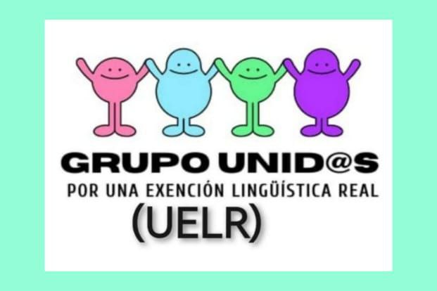

**Euskera** | [Castellano](es)

# HIZKUNTZ-ESKAKIZUNEI BURUZKO SAKIDETZAKO LANGILEEN ADIERAZPENA 

* [Hizkuntz-eskakizunei buruzko Osakidetzaako langileen adierazpena](#hizkuntz-eskakizunei-buruzko-osakidetzaako-langileen-adierazpena)
* [Lotutako albisteak](#lotutako-albisteak)
* [Informazioa jasotzeko](#informazioa-jasotzeko)

## Osakidetzaako langileek hizkuntz-eskakizunei buruz egindako adierazpena

Osasun arloko 685 kideko profesional talde bat gara, eta 1927 sinadurarekin, bat egin behar izan dugu euskararen hizkuntza-eskakizunen politikari buruzko kezka sakona adierazteko. Euskadin hizkuntza eta hizkuntza-eskubideak babestu eta sustatzearen garrantzia ulertzen badugu ere, uste dugu hartutako abusuzko neurriek hainbat bidegabekeria eta mugapen sortzen ari direla Osakidetzan lanean urteak daramatzaten osasun-profesionalen zati handi batentzat.

Gure erkidego honetan bi hizkuntza ofizial ditugu, eta horiei balioa eman behar zaie. Eta, beraz, horietako baten profila ez izateak ez luke baztertzailea izan behar osasun publikoaren eremuan lanpostu bat lortzeko. Profilak neurriz kanpo eskatzeak oztopo bidegabeak sortzen ditu osasun-arloko ezagutza frogatuak eta esperientzia luzea izanik gure osasun-zerbitzuari kalitatea ematen dioten profesionalentzat, eta, hala ere, ez edukitzeagatik alboratuta eta gutxietsita geratzen diren profesionalentzat.

Neurri horiek osasun-arloko profesionalen lan-mugikortasuna mugatzen dute, eta zaildu egiten dute langile kualifikatuak kontratatzea. Horrek ondorioak izan ditzake Osakidetzaren kalitatean eta eraginkortasunean, esperientzia handiena duten profesionalak herritarrei kenduz.

Azpimarratu nahi dugu adinez zaharragoak diren profesionalak, beraien baldintza pertsonalengatik, baina, batez ere, baldintza sozialengatik, ez zutela euskara arintasunez ikasteko aukerarik izan, baina, hala ere, ibilbide profesional luzea dutela Osakidetzan. Berriro diogu euskara sustatzeko eta zaintzeko eta arreta euskaraz ematea aukeratzen duten pazienteen % 17ri dagokion moduan artatzeko ahaleginak balioesten ditugula, baina neurri horiek ekitatezkoak izatearen eta langile guztien eskubideak errespetatzearen garrantzia ere berresten dugu. Neurri horien gaur egungo aplikazioa, lanpostua galtzen duten profesionalen kolektiboarentzat ez ezik, Osakidetzarentzat ere kalte handia da giza kapitala galduz, pertsona horietako askok urteak baitaramatzate lanean eta esperientzia pilatzen osasun-zerbitzuan. Horretarako, eskaera hauek egiten ditugu:

Neurri horiek baztertzaileak eta diskriminatzaileak ez izatea eskatzen diegu, langile bakar bat ere ez bailitzateke diskriminatuta sentitu beharko gutxienez autonomia-erkidegoko hizkuntza ofizialetako bat erabiltzeko gai bada.

Eusko Jaurlaritzaren hizkuntza-neurrien ezarpena hobetzeko eskatzen dizuegu, neurri horiek progresiboki izan daitezen, egungo biztanleek eskatzen duten bezala, Osakidetzako adineko langileei benetako liberazioa emanez.

Osakidetzari emandako erantzunean datuek erakusten dugun bezala, gaur egun lanaldiaren barruan euskara ikasteko liberazioak ez dira nahikoak, eta lanalditik kanpoko eskaera guztiak ere ez dira betetzen.

Axola zaiena hizkuntza bada, beste gai batzuen gainetik, gure ustez, hain zurruna den modu horrek ez du laguntzen euskararen erabilera gizartean zabaltzen, edo ekartzen digun kasura eramaten, Osakidetzako langileengana. Neurri batzuk benetako progresiboak direnean, egungo errealitatea errespetatuz, entzunez eta aukerak emanez, jendeari ikasten jarraitzeko nahia sustatzen eta ezartzen diote; gaur egungo neurriekin gertatzen ari denaren kontrakoa.

19/2024 Dekretuaren 34.5 artikuluan, pertzeptibitatea eskala guztien artean banatu behar da, ekitatez eta proportzioz.

Proposatutako neurriak honako hauek izan daitezke:

* Bizkaiko Foru Aldundiak derrigorrezko hizkuntza-eskakizuna duten lanpostuak betetzeari lehentasuna emateko praktika berreskuratzea, arreta elebiduna bermatzeko, eta hizkuntza-eskakizuna ez dutenei aukera emateko (ez du zentzurik hizkuntza-eskakizuna duten langileek elebidunak ez diren lanpostuak betetzea). Horrela, bada, % 50 profilatutako plazak aukeratzeko prozesuan, hizkuntza-eskakizuna duten pertsonek profilatutako plazak aukeratzea eta hizkuntza-eskakizunik gabeko plazak libre uztea. Horrela, hizkuntza-eskakizuna betetzen ez duten pertsonek profilatu gabeko plazak eskuratu ahal izango dituzte.
* 55 urtetik gorako langile finko eta aldi baterako langile guztiak salbuestea, eta kontratazioak ez mugatzea (kontratu laburrak, bajak, lanpostu hutsak, lekualdatzeak, plazak, etab.) profila ez izateagatik. Urteetan Osakidetzaren sisteman gauden langileok baloratzeko eskatzen dugu, merezi baitugu zokoratuta ez sentitzea.
* Lan-poltsak direnean, izangai bakoitzak poltsan parte hartu ahal izango du eta, hala badagokio, sartu ahal izango da, baina hizkuntza-eskakizunak ez du eraginik izango puntuazioan, Eusko Jaurlaritzako oposizioen osteko zerrendetan egiten den bezala, eta Osakidetzan egiten zen bezala.
* Osakidetzako langile guztiek, bitartekoek zein finkoek, lan-ordutegiaren barruan euskara ikasteko eskubidea eta aukera berberak dituztela bermatzea, adina edo kontratu-harremanaren araberako bazterketarik gabe.
* A1 eta A2 mailak eta ulermen-gaitasunak (ulermendun) merezimendu gisa baloratzea, orain hizkuntza-eskakizunen sistematik kanpo dauden pertsonei aukera gehiago emateko. A1 eta A2 mailak, 2017ko legez besteko proposamen batean (PNL) eta 2017-2020ko Euskararen Agenda Estrategikoan adostu zen bezala (53-54 or.).
* Osakidetzako kategoria guztiei hizkuntza-eskakizun portzenteje bera eskatzea, unibertsitatekoak ez diren lanpostuenak kargatu gabe, pazienteekiko oinarrizko komunikazio-mailekin.
* Gainditu dutenen eta gainditu ez dutenen bi kontratazio-zerrendak berreskuratzea, Osakidetzan lehen egiten zen bezala; izan ere, EPE bat esperientziari gehitutako ezagutza profesionala baloratzeko egiten da; horixe lehenetsi beharko litzateke osasun-premiak dituzten pertsonekin lan egiten den lan publikoan.
* Konpondu gabe dagoen LEPak (egonkortzekoak) egonkortzea azpimarratu behar du. Lan egindako denbora gehien duten pertsonek plaza lortzeko diren merezimendu-lanpostuak, beste edozein puntuazioren gainetik lehenetsiz. Lan-eskaintza publiko horretako gainerako plazek malgutasun handia izan beharko lukete euskararekiko, Osakidetzan esperientzia handia duten ahalik eta langile gehien egonkortzeko.

Horregatik guztiagatik, berrikuspen sakon bat eskatzen dugu, gizartearekiko eta langileekiko errespetuzkoa izango dena, esperientzia gainerako guztiaren gainetik nabarmenduz eta neurriak modu mailakatuan hartuz, langileek erretiroa modu duinean eta bazterketarik gabe hartzeko aukera izan dezaten. Une honetan, eta Osakidetzako pazienteen artean neurtutako euskararen egungo eskaerarekin, lehentasuna izan beharko litzateke eskari hori bideratzeko antolaketa-moduak bilatzea hizkuntza-eskakizuna egiaztatzen duten baliabideekin, gero eta lanpostu gehiagotan hizkuntza-eskakizuna masiboki eskatu beharrean.

Eskerrik asko zuen arretagatik, eta langileen batzorde batekin batera lan egiteko eskatzen dizuegu, komunitate osoari mesede egingo dioten eta lan-eremuan aukera-berdintasuna bermatuko duten konponbideak aurkituko ditugulakoan.

Adeitasunez,
"Baturik hizkuntz-salbuespen erreal baten aldeko" profesional-taldea.

## Lotutako albisteak

* [Sanitarios solicitan que Osakidetza no valore tanto el euskera en sus contratos - El Correo](https://www.elcorreo.com/sociedad/salud/sanitarios-solicitan-osakidetza-valore-euskera-contratos-20240719001606-nt.html)
* [«Osakidetza tendría que primar la experiencia sobre el euskera» - El Correo](https://www.elcorreo.com/sociedad/salud/osakidetza-primar-experiencia-sobre-euskera-20240720002821-nt.html)
* [Profesionales de la Salud vasca piden que el euskera no prevalezca sobre el conocimiento en Bilbao - Tele 5](https://www.telecinco.es/noticias/euskadi/20240905/profesionales-salud-euskera-conocimientos-hospitales-bilbao_18_013376211.html)
* [Bazterketarik gabeko Osakidetzaren alde - Berria](https://www.berria.eus/iritzia/artikuluak/bazterketarik-gabeko-osakidetzaren-alde_2129994_102.html)
* [Una política lingüística errónea perjudica gravemente la salud - El Correo](https://www.elcorreo.com/opinion/tribunas/teresa-perales-jose-do-pozo-raquel-reglado-josebe-vicente-politica-linguistica-erronea-perjudica-gravemente-salud-20250213205503-nt.html)
* [Una política lingüística errónea perjudica gravemente la salud - irekian](https://www.almendron.com/tribuna/una-politica-linguistica-erronea-perjudica-gravemente-la-salud/)

## Informazioa jasotzeko

* [WhatsApp](https://chat.whatsapp.com/J3jWpnjJAWlJm9dGGHl7OH)
* [Facebook](https://www.facebook.com/share/g/FNTci96ehkhQ8vSZ/)

<meta property="og:title" content="convivencialinguisticaosakidetza">

