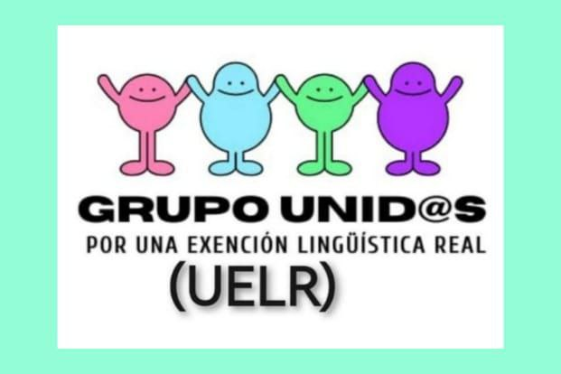

[Euskera](/) | **Castellano**  

# MANIFIESTO DE TRABAJADOR@S DE OSAKIDETZA SOBRE LOS PERFILES LINGÜÍSTICOS
* [Manifiesto de trabajadores de Osakidetza sobre los perfiles lingüísticos](#manifiesto-de-trabajadores-de-osakidetza-sobre-los-perfiles-lingüísticos)
* [Noticias relacionadas](#noticias-relacionadas)
* [Para mantenerte informado](#para-mantenerte-informado)

## Manifiesto de trabajadores de Osakidetza sobre los perfiles lingüísticos

Somos un grupo de profesionales de la salud de 685 miembros, y con 1927 firmas que nos hemos visto en la necesidad de unirnos para mostrar nuestra profunda preocupación respecto a la política de perfiles lingüísticos del euskera. Si bien entendemos la importancia de preservar y promover la lengua y los derechos lingüísticos en Euskadi, consideramos que las medidas abusivas  tomadas están generando una serie de injusticias y limitaciones para una parte importante de los profesionales de salud que llevan años trabajando en Osakidetza.

En esta nuestra comunidad tenemos dos idiomas oficiales, a los cuales hay que dar valor. Y por tanto, no tener el perfil de uno de ellos, no debería ser excluyente para acceder a un puesto de trabajo en el ámbito de la Sanidad pública. Exigir el perfil desproporcionadamente crea barreras injustas para aquellos profesionales que con probados conocimientos y larga experiencia en sanidad, aportan calidad a nuestro servicio de salud y que, sin embargo, se ven desplazados y ninguneados por el hecho de no tenerlo.

Estas medidas limitan la movilidad laboral de los profesionales de la salud, dificultando la contratación de personal cualificado. Esto podría tener consecuencias para la calidad y la eficiencia en Osakidetza, privando a la ciudadanía de los profesionales con mayor experiencia.

Queremos hacer hincapié en los profesionales de mayor edad que por sus condiciones personales, pero sobre todo sociales, no tuvieron la oportunidad de aprender el euskera con fluidez, pero, sin embargo, tienen una larga trayectoria profesional en Osakidetza. Reiteramos que valoramos los esfuerzos por promover y preservar el euskera y atender como corresponde al 17% de los pacientes que optan por la atención en euskera, pero también reiteramos la importancia de que estas medidas sean equitativas y respeten los derechos de todos los trabajadores. La aplicación actual de estas medidas no solo supone un perjuicio para el colectivo de profesionales que pierde su puesto de trabajo, sino también para Osakidetza supone una importante pérdida de capital humano, puesto que un buen número de estas personas llevan años trabajando y adquiriendo experiencia en el servicio de salud. Con este fin, realizamos las siguientes peticiones:

Les solicitamos que estás medidas no sean excluyentes, ni discriminatorias, pues ningún trabajador tendría que sentirse discriminado si es capaz de manejar al menos una de las lenguas oficiales de la comunidad autónoma.

Les instamos a mejorar la implantación de las medidas lingüísticas del Gobierno Vasco, para que sean de la forma progresiva, como la actual población lo requiere, efectuando una liberación real a los trabajadores mayores en Osakidetza.

Como lo demostramos con datos en nuestra contestación a Osakidetza, las actuales liberaciones para aprender euskera dentro de la jornada laboral son muy insuficientes siendo también no cubiertas todas las peticiones para fuera de la jornada laboral.

Si lo que les importa es la lengua por encima de otras cuestiones, opinamos que de esta forma tan rígida no ayuda a ampliar el uso del euskera en la sociedad, o llevándolo al caso que nos trae, a los trabajadores de Osakidetza. Cuando unas medidas son progresivas de verdad, respetando, escuchando la realidad actual y dando oportunidades, incentivan e instauran en la gente un deseo de seguir aprendiendo; lo contrario de lo que ahora está pasando con las actuales medidas.

En el artículo 34.5 del Decreto 19/2024, la perceptividad debe distribuirse equitativa y proporcional entre todas las escalas.

Las medidas propuestas podrían ser:

* Recuperar la práctica de la Diputación de Bizkaia de priorizar la cobertura de los puestos con perfil lingüístico preceptivo, para garantizar la atención bilingüe y dar oportunidad a quienes no tienen el perfil (no tiene sentido que el personal con perfil ocupe puestos no bilingües). Así pues en el proceso de elección de plazas 50% perfiladas, siendo que  las personas que tienen perfil elijan las plazas perfiladas, dejando libres las plazas sin perfil. De esta manera, las personas que no cumplan con el perfil, podrán optar a las plazas no perfiladas.
* Pedimos la exención a la edad de 45 para quienes cuenten con 10 años de tiempo trabajado en las administraciones públicas. Así como también la exención para todos los fijos y eventuales mayores de 55 años, no limitando las contrataciones  (contratos cortos, bajas, vacantes, traslados, plazas, etc.) por no tener el perfil. Los trabajadores que ya estamos en el sistema de Osakidetza durante años pedimos se nos valore, pues merecemos no sentirnos arrinconados.
* Cuando se trate de bolsas de empleo, cada aspirante podrá participar y en su caso integrarse en la bolsa sin que el perfil afecte a la puntuación como se hace en las listas tras las oposiciones de Gobierno Vasco y como se hacía en Osakidetza.
Garantizar que todo el personal de Osakidetza tanto interino como fijo tenga el derecho y las mismas oportunidades para liberarse para estudiar euskera dentro del horario laboral, sin discriminación de edad o del tipo de relación contractual.
* Valoración como mérito de los niveles A1 Y A2 y de las competencias de comprensión (ulermendun), para dar más oportunidades a gente que ahora está fuera del sistema de perfiles lingüísticos. Niveles A1 y A2, tal como se había acordado en una proposición no de ley (PNL) de 2017 y en la Agenda Estratégica de Euskera 2017-2020  (pág 53-54).
* Dejar de exigir el mismo perfil lingüístico a todas las categorías de Osakidetza, rebajando el de las plazas no universitarias, con niveles básicos de comunicación con las personas pacientes.
* Recuperar las dos listas de contratación de aprobados y no aprobados como se hacía previamente en Osakidetza, pues una OPE se hace para valorar conocimiento profesional añadido a la experiencia; es lo que debería de primar en un trabajo público trabajando con personas con necesidades de salud.
* La OPE que está pendiente de resolverse (de estabilización) debe hacer hincapié en estabilizar. Los puestos de méritos que sean para que obtengan plaza las personas que mayor tiempo trabajado tengan, primando sobre cualquier otra puntuación. El resto de plazas dentro de esa OPE debería tener un carácter de amplia flexibilidad sobre el euskera, así estabilizar al mayor número de trabajadores con amplia experiencia en Osakidetza.

Por todo ello, solicitamos una revisión exhaustiva que sea respetuosa con la sociedad y sus trabajadores, enfatizando la experiencia sobre todo lo demás y tomando así las medidas de forma escalonada, permitiendo que las trabajadoras puedan llegar a jubilarse de forma digna y sin limitaciones. En este momento y con la actual demanda de euskera medida entre los pacientes de Osakidetza, la prioridad debiera ser buscar maneras organizativas de canalizar dicha demanda con los recursos que ya acrediten el perfil lingüístico,en lugar de exigir el perfil masivamente en cada vez más puestos.

Agradecemos su atención y les emplazamos a trabajar juntos con una Comisión de trabajadores, con la esperanza de que así podamos encontrar soluciones que beneficien a toda la comunidad y garanticen la igualdad de oportunidades en el ámbito laboral.

Atentamente,

El grupo de profesionales “Unidas por una Exención Lingüística Real”.

## Noticias relacionadas

* [Sanitarios solicitan que Osakidetza no valore tanto el euskera en sus contratos - El Correo](https://www.elcorreo.com/sociedad/salud/sanitarios-solicitan-osakidetza-valore-euskera-contratos-20240719001606-nt.html)
* [«Osakidetza tendría que primar la experiencia sobre el euskera» - El Correo](https://www.elcorreo.com/sociedad/salud/osakidetza-primar-experiencia-sobre-euskera-20240720002821-nt.html)
* [Profesionales de la Salud vasca piden que el euskera no prevalezca sobre el conocimiento en Bilbao - Tele 5](https://www.telecinco.es/noticias/euskadi/20240905/profesionales-salud-euskera-conocimientos-hospitales-bilbao_18_013376211.html)
* [Bazterketarik gabeko Osakidetzaren alde - Berria](https://www.berria.eus/iritzia/artikuluak/bazterketarik-gabeko-osakidetzaren-alde_2129994_102.html)

## Para mantenerte informado

* [WhatsApp](https://chat.whatsapp.com/J3jWpnjJAWlJm9dGGHl7OH)
* [Facebook](https://www.facebook.com/share/g/FNTci96ehkhQ8vSZ/)

<meta property="og:title" content="convivencialinguisticaosakidetza">

